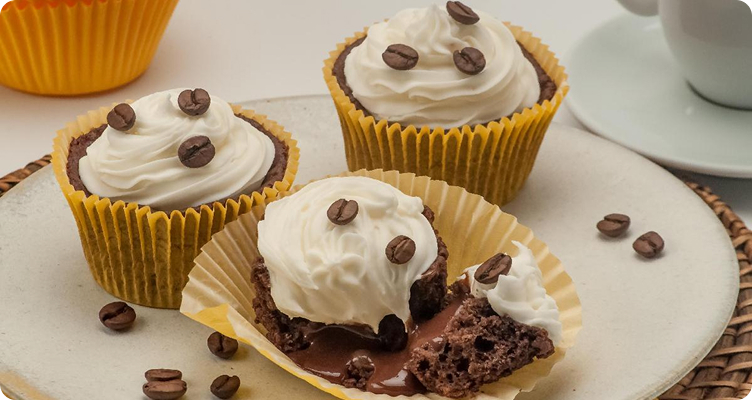

<h1 align="center">🧁 Página de Receita | Recipe Page</h1>

<p align="center">


</p>

<p align="center">
🇧🇷 <a href="#pt-br">Português</a> | 🇺🇸 <a href="#en">English</a>
</p>

---

# 🇧🇷 Português

<h2 id="pt-br"></h2>

<p align="center">
Uma página web de receitas que apresenta ingredientes e modo de preparo de uma deliciosa receita de cupcake de café com chantilly.
</p>

<p align="center">
<a href="https://github.com/Marcelo-Figueira-Junior/Pagina-de-receita">📱 Ver Projeto</a>
</p>

---

## 📖 Sobre o Projeto

Este projeto é uma **página web de receita**, desenvolvida utilizando apenas **HTML e CSS**.

A página apresenta:

* 📋 Lista de ingredientes
* 👨‍🍳 Modo de preparo detalhado
* 🎨 Layout organizado e visual agradável

O objetivo do projeto é **praticar estruturação de páginas HTML e estilização com CSS**, simulando uma página de receita culinária.

---

## 🎨 Layout

<p align="center">

</p>

---

## 💻 Tecnologias

* HTML5
* CSS3

---

## 🚀 Como executar o projeto

### Pré-requisitos

Você precisa apenas de:

* Um navegador (Chrome, Edge, Firefox etc.)
* Opcional: **VS Code + Live Server**

---

### Clonar o projeto

```bash
git clone https://github.com/Marcelo-Figueira-Junior/Pagina-de-receita.git
```

---

### Executar

Entre na pasta:

```bash
cd Pagina-de-receita
```

Depois:

* Abra **index.html** no navegador

ou

* Use **Live Server**

---

## 👨‍💻 Autor

<table>
<tr>
<td align="center">
<a href="https://github.com/Marcelo-Figueira-Junior">

<br>
<sub><b>Marcelo Figueira Junior</b></sub>
</a>
</td>
</tr>
</table>

---

# 🇺🇸 English

<h2 id="en"></h2>

<p align="center">
A simple recipe web page that presents ingredients and preparation instructions for a delicious coffee cupcake with whipped cream.
</p>

<p align="center">
<a href="https://github.com/Marcelo-Figueira-Junior/Pagina-de-receita">📱 Visit Project</a>
</p>

---

## 📖 About the Project

This project is a **recipe web page** built using only **HTML and CSS**.

The page includes:

* 📋 Ingredients list
* 👨‍🍳 Step-by-step preparation instructions
* 🎨 Clean and organized layout

The goal of this project is to **practice HTML page structure and CSS styling**, simulating a real cooking recipe page.

---

## 🎨 Layout

<p align="center">

</p>

---

## 💻 Technologies

* HTML5
* CSS3

---

## 🚀 Getting Started

### Prerequisites

You only need:

* A web browser (Chrome, Edge, Firefox, etc.)
* Optional: **VS Code + Live Server**

---

### Clone the repository

```bash
git clone https://github.com/Marcelo-Figueira-Junior/Pagina-de-receita.git
```

---

### Running the project

Enter the project folder:

```bash
cd Pagina-de-receita
```

Then:

* Open **index.html** in your browser

or

* Use **Live Server**

---

<p align="center">
⭐ If you liked this project, consider giving it a star!
</p>

